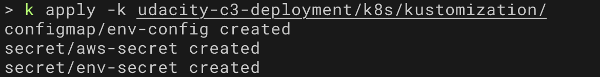
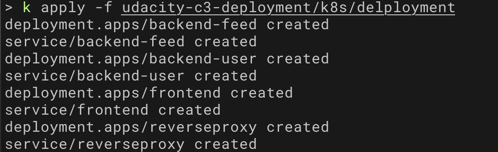
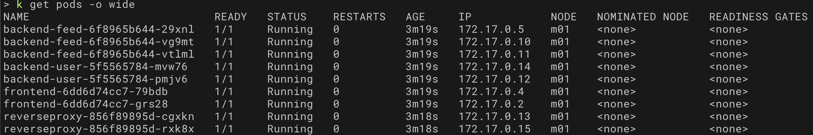
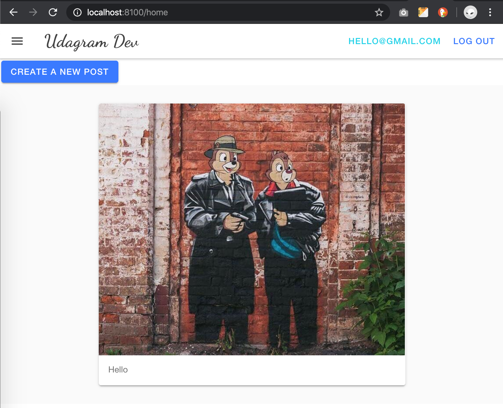
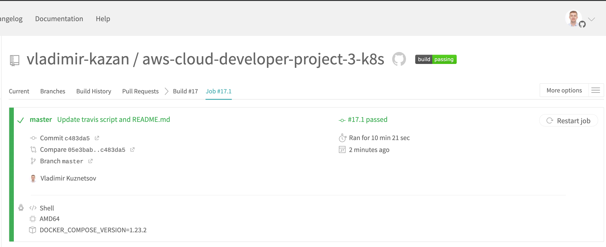

# Udagram Image Filtering Microservice

[](https://travis-ci.com/vladimir-kazan/aws-cloud-developer-project-3-k8s)

# Run in k8s cluster

All commands are supposed to run with `alias k=kubectl`


## 1. Create Secrets and Config maps

Before running scripts it's necessary to prepare files with data.

These files should be in `.gitignore` or in separated secret repository together with `kustomization.yaml` file.

- *udacity-c3-deployment/k8s/kustomization/.env*
  - environment variables for ConfigMap with name `env-config`
- *udacity-c3-deployment/k8s/kustomization/.env.secret*
  - secret envrionment variables for Secret with name `env-secret`
- *udacity-c3-deployment/k8s/kustomization/credentials*
  - aws credetials for Secret with name `aws-secret`

There are examples of these files in the current repostitory:
- .env.sample
- .env.secret
- credentials.sample

To create Secrets and ConfigMaps please run next command:
```sh
k apply -k udacity-c3-deployment/k8s/kustomization
```



## 2. Create Deployments and Services

```sh
k apply -f udacity-c3-deployment/k8s/delployment
```




**List of running Pods:**



## 3. Port Forwarding and test locally

```sh
k port-forward service/reverseproxy 8080:8080

# run in separted terminal session
k port-forward service/frontend 8100:8100
```

then how it looks like in browser




# CI/CD

After each commit to the `master` branch it starts `build-and-deploy` job in Travis service.




# Docker Hub Images

Images created by CI/CD pipeline:
- https://hub.docker.com/r/vladimirkazan/nanodegree-udacity-frontend
- https://hub.docker.com/r/vladimirkazan/nanodegree-udacity-restapi-feed
- https://hub.docker.com/r/vladimirkazan/nanodegree-udacity-restapi-user
- https://hub.docker.com/r/vladimirkazan/nanodegree-udacity-reverseproxy

